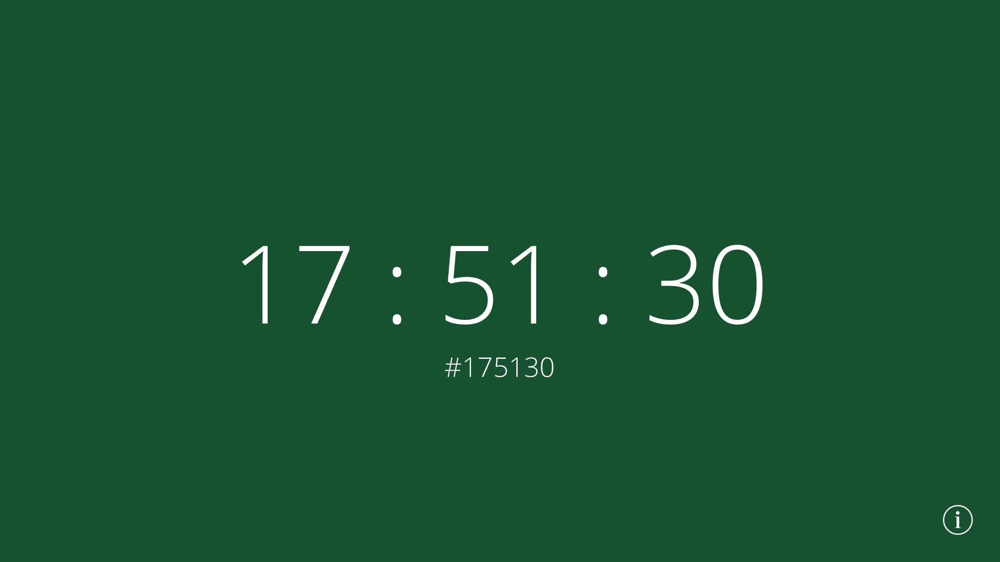
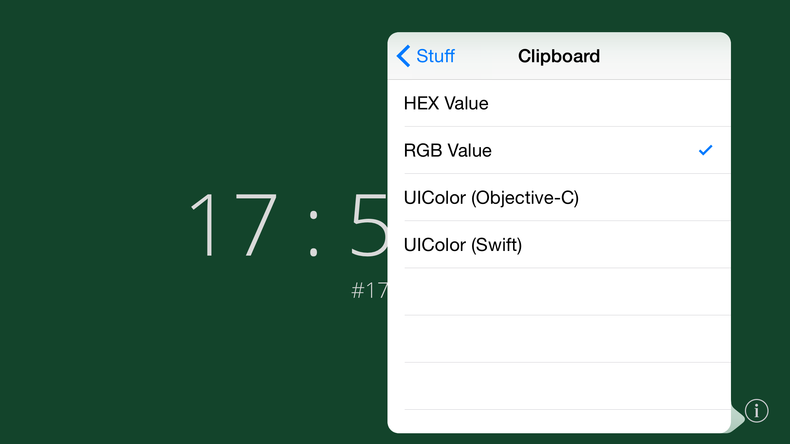
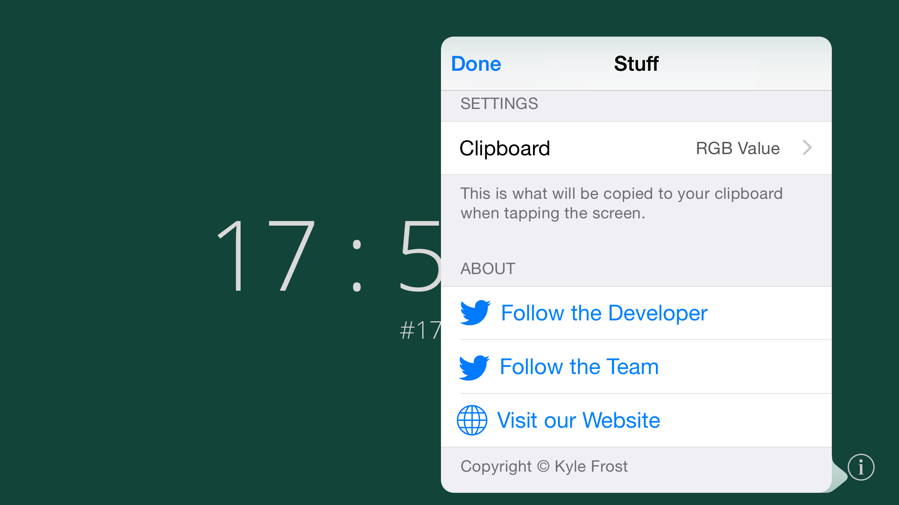
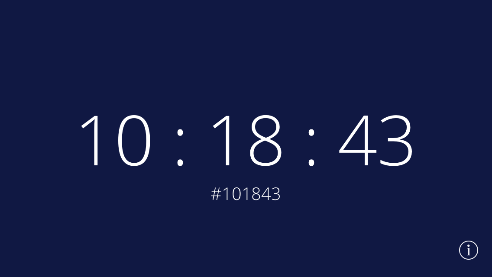
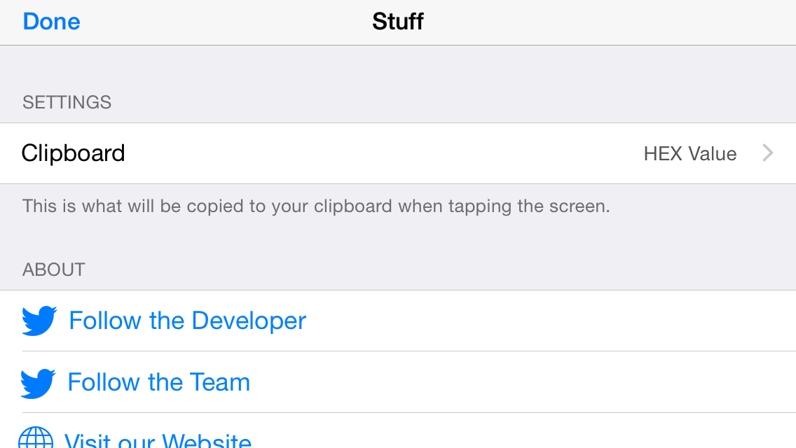
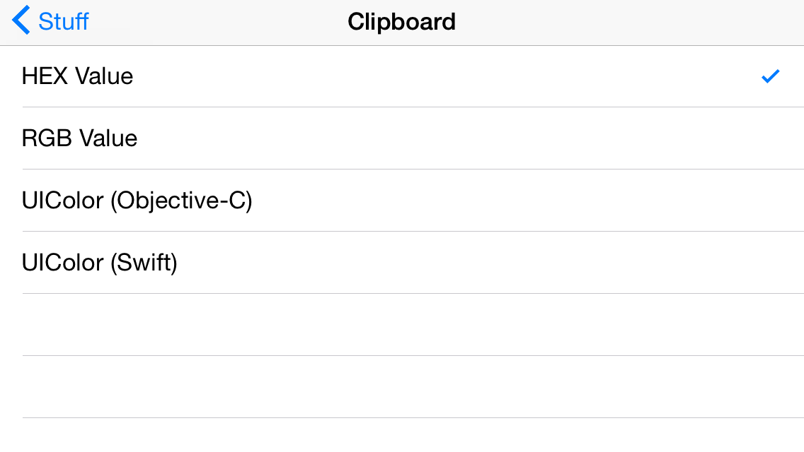
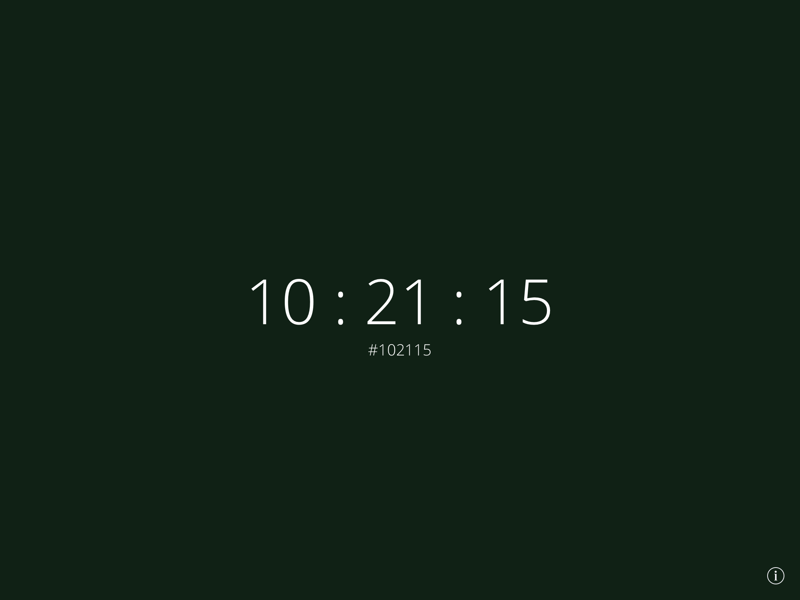
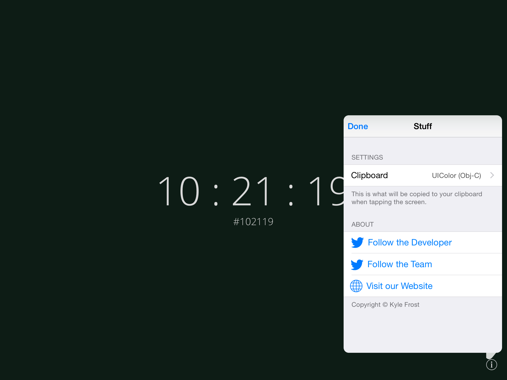
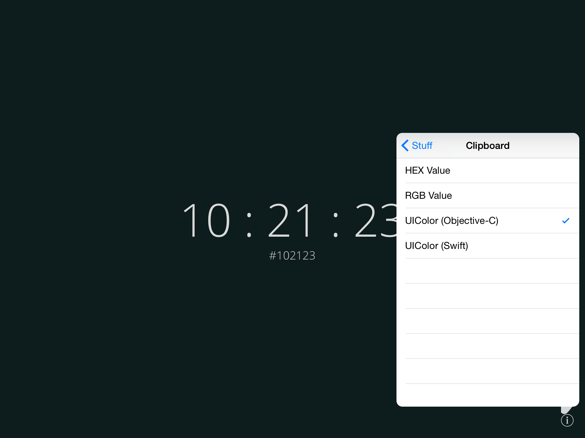
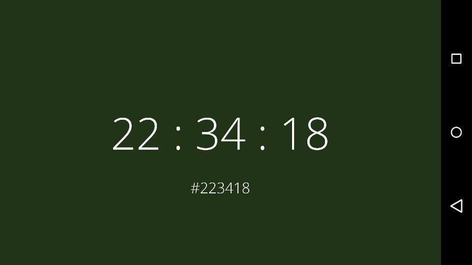

WhatColorIsIt
=============

Adaptation of http://whatcolourisit.scn9a.org/ for iOS and Android.

__iOS app is submitted to App Store pending approval. 
Android app can be downloaded here: [Color.apk](http://www.kylefrost.me/docs/color.apk).__

#### Note regarding iOS vs. Android
*I wanted to submit this to the App Store (as a free app) because I have an account, but Apple won't allow just a clock app into the App Store, hence the "copy to clipboard" functionality. I don't currently have plans to build this into the Android version unless it's requested enough. Or, you know, fork and pull request it!*

## iOS Screenshots
#### iPhone 6 Plus

#### iPhone 4-inch

#### iPad

## Android Screenshots
#### Nexus 5

*More Android shots coming soon...*
